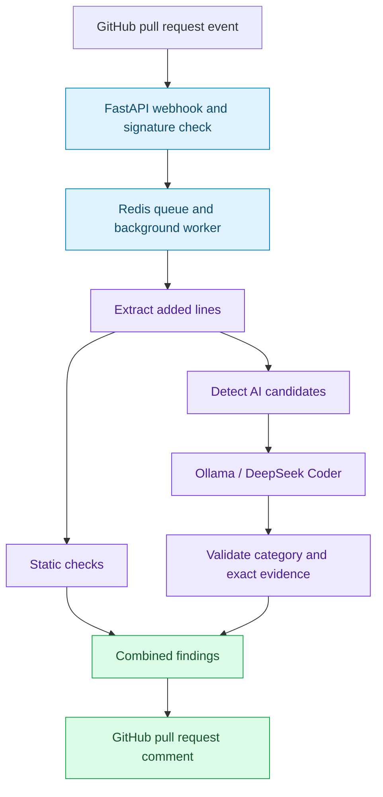

# PatchIQ-iA · Team Contributions

> **GitHub pull request security analysis**  
> Architecture · Backend · AI validation · Quality assurance · Documentation

PatchIQ-iA reviews added pull request code using static checks and AI-assisted analysis, then reports validated findings through GitHub comments. This document describes the team's contributions to implementation, testing, troubleshooting and repository maintenance.

[Project team](#project-team) · [Individual contributions](#individual-contributions) · [System workflow](#system-workflow) · [Development troubleshooting](#development-troubleshooting)

---

## Project Team

| Member | Registration Number | Role |
|:---|:---:|:---|
| **Ayush Kumar Singh** | `25BCE11163` | System architecture, backend development, AI pipeline and DevOps |
| **Aditya Pandey** | `25BCE11019` | Pull request testing, quality assurance and development troubleshooting |
| **Atharva Singh** | `25BCE10984` | Technical documentation, architecture documentation and development troubleshooting |
| **Vishal Yadav** | `25BCE11149` | Test coverage and vulnerability examples |
| **Krishna Nishad** | `25BCE11329` | Repository maintenance and backend configuration support |

---

## Individual Contributions

### Ayush Kumar Singh

**System architecture · Backend development · AI pipeline · DevOps**

- **System design:** Designed the architecture connecting the GitHub webhook receiver, Redis queue, background worker and analysis pipeline.
- **GitHub App integration:** Configured permissions, webhook settings and private-key authentication through `GithubIntegration`.
- **Webhook backend:** Implemented the FastAPI receiver in `app/main.py`, including HMAC-SHA256 signature verification.
- **Background processing:** Developed the Redis-backed job queue and worker in `app/worker.py` to process analysis jobs outside the webhook request.
- **Code analysis:** Built `app/processor.py` to extract added lines, run static checks and identify candidates for the seven supported vulnerability categories.
- **AI integration and validation:** Integrated Ollama and DeepSeek Coder with structured JSON output, then validated findings using a category whitelist, candidate checks and exact evidence matching.
- **Review reporting:** Implemented combined pull request comments that present accepted security findings and their supporting code evidence.
- **Local deployment:** Configured Docker, Docker Compose and ngrok, integrated the components and verified the system on live pull requests.
- **Troubleshooting collaboration:** Worked with Aditya Pandey and Atharva Singh on integration issues and contributed implementation context to the troubleshooting guidance.

### Aditya Pandey

**Pull request testing · Quality assurance · Issue investigation · Troubleshooting guidance**

**Pull request validation**

- Tested the bot using pull requests containing vulnerable and clean code samples prepared for the project.
- Checked the analysis flow when opening pull requests and pushing additional commits, following webhook delivery through to the final review comment.
- Verified that reported evidence corresponded to newly added lines in the pull request diff.
- Compared expected findings with actual results, recording missed vulnerabilities, incorrect reports and false positives.
- Reviewed the clarity of combined bot comments, including the relationship between each finding and its supporting code evidence.
- Re-tested reported problems after fixes and checked clean-code results for unnecessary or misleading findings.

**Development troubleshooting**

- Investigated development-related failures alongside Atharva Singh and Ayush Kumar Singh, using webhook delivery details and application output to reproduce problems.
- Helped resolve GitHub App authentication mismatches, stale worker processes, Docker startup problems and webhook URL changes after ngrok restarts.
- Co-developed troubleshooting guidance with Atharva Singh, translating observed failures into clear checks and recovery steps.
- Verified recovery steps through follow-up pull request tests and shared reproducible observations to support further debugging.

### Atharva Singh

**Technical documentation · Architecture explanation · Issue resolution · Troubleshooting guidance**

**Documentation and architecture**

- Organized the README around the project purpose, supported vulnerability categories, setup requirements and usage.
- Documented the flow from webhook receipt through queued processing, code analysis, finding validation and pull request commenting.
- Explained why Redis separates webhook handling from background analysis and how the API and worker interact.
- Reviewed setup instructions for environment configuration, GitHub App authentication and local service startup.

**Development troubleshooting**

- Worked with Aditya Pandey and Ayush Kumar Singh to investigate and resolve problems encountered during setup and integration.
- Helped trace authentication failures to App ID or private-key mismatches and checked the configuration steps needed to restore connectivity.
- Investigated outdated worker behaviour, Docker availability and ngrok URL changes that affected local testing.
- Co-authored troubleshooting guidance with Aditya Pandey, organizing each issue by its symptoms, diagnostic checks and recovery steps.
- Updated setup explanations to reflect the fixes and restart requirements identified during development.

### Vishal Yadav

**Test coverage · Vulnerability samples · Example outputs**

- **Vulnerability samples:** Prepared examples covering hardcoded secrets, `eval()`/`exec()`, command injection, SQL injection, path traversal, insecure deserialization and unsafe YAML loading.
- **Clean-code baseline:** Prepared a sample without intentional vulnerabilities to help check for false positives.
- **Candidate detection:** Reviewed which samples activated the supported categories and how those candidates affected AI analysis.
- **Example organization:** Organized sample inputs and corresponding analysis outputs for comparison and demonstration.
- **Coverage review:** Compared expected and actual findings to identify missed cases and false positives for further refinement.

### Krishna Nishad

**Repository maintenance · Configuration support**

- Reviewed `.gitignore` rules for `.env`, private-key files such as `*.pem` and other local configuration artifacts.
- Reviewed repository history for accidentally committed credentials or sensitive configuration files.
- Helped keep `.env.example` aligned with application configuration requirements using placeholder values.
- Proofread README setup instructions and checked documentation links.
- Assisted with backend setup by checking environment-variable names used by the API and worker and helping correct minor configuration mismatches.

---

## System Workflow

The implementation, test cases and troubleshooting guidance cover the following processing flow. Static findings and validated AI findings feed into the combined review output.

---

## Development Troubleshooting

Aditya Pandey and Atharva Singh investigated development issues and prepared troubleshooting guidance in collaboration with Ayush Kumar Singh. Their work connected reproducible failures with configuration checks, recovery steps and follow-up testing.

| Development issue | Diagnostic checks | Recovery guidance |
|:---|:---|:---|
| **GitHub API returns `401 Unauthorized`** | Check that the App ID and private key belong to the same GitHub App and that the key loads correctly. | Correct the App ID or key configuration, restart affected services and retry authentication. |
| **Worker uses outdated code** | Check whether the worker restarted after the change and whether it runs the current source or image. | Restart the worker. Rebuild the Docker image when the code is included in the image rather than mounted from the working directory. |
| **Docker services fail to start** | Check that Docker Desktop is running and the Docker daemon is ready. | Start Docker Desktop, wait for the daemon and rerun Docker Compose. |
| **Webhook delivery stops after an ngrok restart** | Compare the active ngrok HTTPS URL with the URL configured in the GitHub App. | If the URL changed, update the webhook URL while preserving the endpoint path, then redeliver a failed webhook. |

---

*Attribution note: This is a draft based on the team's supplied contribution descriptions. Individual contributions have not been independently checked against repository history.*
